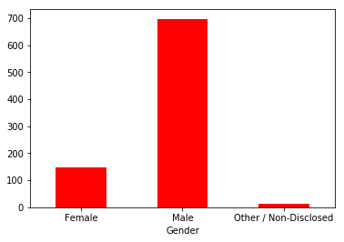
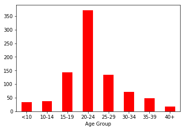

# In-Game_Purchase_Analysis


Many online games are free-to-play, but allow for in-game purchases of special abilities or items. Here, a mock dataset of in-game purchases and user profiles can be found in the input_data folder of this repo. In order to tailor marketing efforts and to optimize the game for revenue generation, this dataset of in-game purchases and corresponding user demographics is analyzed below to uncover trends.
## Goals:
Data will be analyzed using PANDAS and matplotlib to generate a report.
### Important Metrics to Calculate:
#### Player Count

 - Total Number of Players


#### Purchasing Analysis (Total)


 - Number of Unique Items
 - Average Purchase Price
 - Total Number of Purchases
 - Total Revenue


#### Gender Demographics


 - Percentage and Count of Male Players
 - Percentage and Count of Female Players
 - Percentage and Count of Other / Non-Disclosed


#### Purchasing Analysis (Gender) 


The below each broken by gender


 - Purchase Count
 - Average Purchase Price
 - Total Purchase Value
 - Normalized Totals


#### Age Demographics


The below each broken into bins of 4 years (i.e. <10, 10-14, 15-19, etc.) 


 - Purchase Count
 - Average Purchase Price
 - Total Purchase Value
 - Normalized Totals


#### Top Spenders


Identify the the top 5 spenders in the game by total purchase value, then list (in a table):


 - SN
 - Purchase Count
 - Average Purchase Price
 - Total Purchase Value


#### Most Popular Items


Identify the 5 most popular items by purchase count, then list (in a table):


 - Item ID
 - Item Name
 - Purchase Count
 - Item Price
 - Total Purchase Value


#### Most Profitable Items


Identify the 5 most profitable items by total purchase value, then list (in a table):


 - Item ID
 - Item Name
 - Purchase Count
 - Item Price
 - Total Purchase Value

### We will also:

 - Ensure the script works for multiple datasets
 - Include an exported markdown version of the notebook, called README.md in the repo
 - Include a written description of three observable trends based on the data

# Analysis

## Exploration

### Import dependencies:


```python
import pandas as pd
import numpy as np
import matplotlib.pyplot as plt
```

### Load .json files into pandas DataFrames


```python
json1 = pd.read_json('inputfiles/purchase_data.json')
json2 = pd.read_json('inputfiles/purchase_data2.json')
df1 = pd.DataFrame(json1)
df2 = pd.DataFrame(json2)
```

### Explore data


```python
df1.head()

```


<div>
<style scoped>
    .dataframe tbody tr th:only-of-type {
        vertical-align: middle;
    }

    .dataframe tbody tr th {
        vertical-align: top;
    }

    .dataframe thead th {
        text-align: right;
    }
</style>
<table border="1" class="dataframe">
  <thead>
    <tr style="text-align: right;">
      <th></th>
      <th>Age</th>
      <th>Gender</th>
      <th>Item ID</th>
      <th>Item Name</th>
      <th>Price</th>
      <th>SN</th>
    </tr>
  </thead>
  <tbody>
    <tr>
      <th>0</th>
      <td>38</td>
      <td>Male</td>
      <td>165</td>
      <td>Bone Crushing Silver Skewer</td>
      <td>3.37</td>
      <td>Aelalis34</td>
    </tr>
    <tr>
      <th>1</th>
      <td>21</td>
      <td>Male</td>
      <td>119</td>
      <td>Stormbringer, Dark Blade of Ending Misery</td>
      <td>2.32</td>
      <td>Eolo46</td>
    </tr>
    <tr>
      <th>2</th>
      <td>34</td>
      <td>Male</td>
      <td>174</td>
      <td>Primitive Blade</td>
      <td>2.46</td>
      <td>Assastnya25</td>
    </tr>
    <tr>
      <th>3</th>
      <td>21</td>
      <td>Male</td>
      <td>92</td>
      <td>Final Critic</td>
      <td>1.36</td>
      <td>Pheusrical25</td>
    </tr>
    <tr>
      <th>4</th>
      <td>23</td>
      <td>Male</td>
      <td>63</td>
      <td>Stormfury Mace</td>
      <td>1.27</td>
      <td>Aela59</td>
    </tr>
  </tbody>
</table>
</div>


```python
df1.dtypes
```


    Age            int64
    Gender        object
    Item ID        int64
    Item Name     object
    Price        float64
    SN            object
    dtype: object


```python
df2.head()
```


<div>
<style scoped>
    .dataframe tbody tr th:only-of-type {
        vertical-align: middle;
    }

    .dataframe tbody tr th {
        vertical-align: top;
    }

    .dataframe thead th {
        text-align: right;
    }
</style>
<table border="1" class="dataframe">
  <thead>
    <tr style="text-align: right;">
      <th></th>
      <th>Age</th>
      <th>Gender</th>
      <th>Item ID</th>
      <th>Item Name</th>
      <th>Price</th>
      <th>SN</th>
    </tr>
  </thead>
  <tbody>
    <tr>
      <th>0</th>
      <td>20</td>
      <td>Male</td>
      <td>93</td>
      <td>Apocalyptic Battlescythe</td>
      <td>4.49</td>
      <td>Iloni35</td>
    </tr>
    <tr>
      <th>1</th>
      <td>21</td>
      <td>Male</td>
      <td>12</td>
      <td>Dawne</td>
      <td>3.36</td>
      <td>Aidaira26</td>
    </tr>
    <tr>
      <th>2</th>
      <td>17</td>
      <td>Male</td>
      <td>5</td>
      <td>Putrid Fan</td>
      <td>2.63</td>
      <td>Irim47</td>
    </tr>
    <tr>
      <th>3</th>
      <td>17</td>
      <td>Male</td>
      <td>123</td>
      <td>Twilight's Carver</td>
      <td>2.55</td>
      <td>Irith83</td>
    </tr>
    <tr>
      <th>4</th>
      <td>22</td>
      <td>Male</td>
      <td>154</td>
      <td>Feral Katana</td>
      <td>4.11</td>
      <td>Philodil43</td>
    </tr>
  </tbody>
</table>
</div>


```python
df2.dtypes
```


    Age            int64
    Gender        object
    Item ID        int64
    Item Name     object
    Price        float64
    SN            object
    dtype: object


## Concatenate datasets
### Why:

- Datasets have the same column names
- Rows are not in any particular order
- Datatypes for each column are identical across the two datasets
- No information to differentiate the two, such as year or location
- Want to have more accurate analysis, with larger sample


```python
frames = [df1, df2]
```


```python
alldata = pd.concat(frames)
alldata.head()
```


<div>
<style scoped>
    .dataframe tbody tr th:only-of-type {
        vertical-align: middle;
    }

    .dataframe tbody tr th {
        vertical-align: top;
    }

    .dataframe thead th {
        text-align: right;
    }
</style>
<table border="1" class="dataframe">
  <thead>
    <tr style="text-align: right;">
      <th></th>
      <th>Age</th>
      <th>Gender</th>
      <th>Item ID</th>
      <th>Item Name</th>
      <th>Price</th>
      <th>SN</th>
    </tr>
  </thead>
  <tbody>
    <tr>
      <th>0</th>
      <td>38</td>
      <td>Male</td>
      <td>165</td>
      <td>Bone Crushing Silver Skewer</td>
      <td>3.37</td>
      <td>Aelalis34</td>
    </tr>
    <tr>
      <th>1</th>
      <td>21</td>
      <td>Male</td>
      <td>119</td>
      <td>Stormbringer, Dark Blade of Ending Misery</td>
      <td>2.32</td>
      <td>Eolo46</td>
    </tr>
    <tr>
      <th>2</th>
      <td>34</td>
      <td>Male</td>
      <td>174</td>
      <td>Primitive Blade</td>
      <td>2.46</td>
      <td>Assastnya25</td>
    </tr>
    <tr>
      <th>3</th>
      <td>21</td>
      <td>Male</td>
      <td>92</td>
      <td>Final Critic</td>
      <td>1.36</td>
      <td>Pheusrical25</td>
    </tr>
    <tr>
      <th>4</th>
      <td>23</td>
      <td>Male</td>
      <td>63</td>
      <td>Stormfury Mace</td>
      <td>1.27</td>
      <td>Aela59</td>
    </tr>
  </tbody>
</table>
</div>


## Player Count:


```python
alldata.SN.nunique()
```


    612


#### Or as a data frame:


```python
playercount = pd.DataFrame({'Total Players': alldata.SN.nunique()}, index=[0])
playercount
```


<div>
<style scoped>
    .dataframe tbody tr th:only-of-type {
        vertical-align: middle;
    }

    .dataframe tbody tr th {
        vertical-align: top;
    }

    .dataframe thead th {
        text-align: right;
    }
</style>
<table border="1" class="dataframe">
  <thead>
    <tr style="text-align: right;">
      <th></th>
      <th>Total Players</th>
    </tr>
  </thead>
  <tbody>
    <tr>
      <th>0</th>
      <td>612</td>
    </tr>
  </tbody>
</table>
</div>


## Purchasing Analysis (Total)


```python
purchasing_analysis = pd.DataFrame({'Number of Unique Items': alldata['Item ID'].nunique(),
                                   'Average Purchase Price': alldata['Price'].mean(),
                                   'Total Number of Purchases': len(alldata.index),
                                   'Total Revenue': alldata['Price'].sum()},
                                   index=[0])

purchasing_analysis = purchasing_analysis.style.format({'Average Purchase Price': '${:,.2f}',
                                                        'Total Revenue': '${:,.2f}'})

purchasing_analysis
```


<style  type="text/css" >
</style>  
<table id="T_9d789db4_daf3_11e7_9e2b_a0999b1e5b83" > 
<thead>    <tr> 
        <th class="blank level0" ></th> 
        <th class="col_heading level0 col0" >Average Purchase Price</th> 
        <th class="col_heading level0 col1" >Number of Unique Items</th> 
        <th class="col_heading level0 col2" >Total Number of Purchases</th> 
        <th class="col_heading level0 col3" >Total Revenue</th> 
    </tr></thead> 
<tbody>    <tr> 
        <th id="T_9d789db4_daf3_11e7_9e2b_a0999b1e5b83level0_row0" class="row_heading level0 row0" >0</th> 
        <td id="T_9d789db4_daf3_11e7_9e2b_a0999b1e5b83row0_col0" class="data row0 col0" >$2.93</td> 
        <td id="T_9d789db4_daf3_11e7_9e2b_a0999b1e5b83row0_col1" class="data row0 col1" >184</td> 
        <td id="T_9d789db4_daf3_11e7_9e2b_a0999b1e5b83row0_col2" class="data row0 col2" >858</td> 
        <td id="T_9d789db4_daf3_11e7_9e2b_a0999b1e5b83row0_col3" class="data row0 col3" >$2,514.43</td> 
    </tr></tbody> 
</table> 


## Gender Demographics


```python
gender_grouped = alldata.groupby('Gender')
```


```python
# function creates two dataframes showing the count of each gender, plots one, 
# and adds percentage column to the other for table display
def count_and_proportion(groupbyobj):
    
    plottable = pd.DataFrame(groupbyobj.Gender.count())
    analysis = pd.DataFrame(groupbyobj.Gender.count())
    
    analysis['Percentage'] = analysis['Gender'] / analysis['Gender'].sum() * 100

    analysis_renamed = analysis.rename(columns={'Gender':'Frequency'})

    analysis_formatted = analysis_renamed.style.format({'Percentage': '{:.2f}%'})
    
    plt.clf()
    
    plottable.plot(kind='bar', facecolor='red', legend=False, rot=0)
    
    plt.show()
    
    return analysis_formatted
```


```python
count_and_proportion(gender_grouped)
```


    <matplotlib.figure.Figure at 0x1104769e8>





<style  type="text/css" >
</style>  
<table id="T_9da4a268_daf3_11e7_b82c_a0999b1e5b83" > 
<thead>    <tr> 
        <th class="blank level0" ></th> 
        <th class="col_heading level0 col0" >Frequency</th> 
        <th class="col_heading level0 col1" >Percentage</th> 
    </tr>    <tr> 
        <th class="index_name level0" >Gender</th> 
        <th class="blank" ></th> 
        <th class="blank" ></th> 
    </tr></thead> 
<tbody>    <tr> 
        <th id="T_9da4a268_daf3_11e7_b82c_a0999b1e5b83level0_row0" class="row_heading level0 row0" >Female</th> 
        <td id="T_9da4a268_daf3_11e7_b82c_a0999b1e5b83row0_col0" class="data row0 col0" >149</td> 
        <td id="T_9da4a268_daf3_11e7_b82c_a0999b1e5b83row0_col1" class="data row0 col1" >17.37%</td> 
    </tr>    <tr> 
        <th id="T_9da4a268_daf3_11e7_b82c_a0999b1e5b83level0_row1" class="row_heading level0 row1" >Male</th> 
        <td id="T_9da4a268_daf3_11e7_b82c_a0999b1e5b83row1_col0" class="data row1 col0" >697</td> 
        <td id="T_9da4a268_daf3_11e7_b82c_a0999b1e5b83row1_col1" class="data row1 col1" >81.24%</td> 
    </tr>    <tr> 
        <th id="T_9da4a268_daf3_11e7_b82c_a0999b1e5b83level0_row2" class="row_heading level0 row2" >Other / Non-Disclosed</th> 
        <td id="T_9da4a268_daf3_11e7_b82c_a0999b1e5b83row2_col0" class="data row2 col0" >12</td> 
        <td id="T_9da4a268_daf3_11e7_b82c_a0999b1e5b83row2_col1" class="data row2 col1" >1.40%</td> 
    </tr></tbody> 
</table> 


## Purchasing Analysis (Gender)
The below each broken by gender
 - Purchase Count
 - Average Purchase Price
 - Total Purchase Value
 - Normalized Totals


```python
gender_group = alldata.groupby('Gender')
```


```python
# Define function to return this summary type
def purchase_summary(groupbyobj):
    # Generate dataframe of summaries

    results = pd.DataFrame({'Purchase Count': groupbyobj.Price.count(),
                               'Average Purchase Price': groupbyobj.Price.mean(),
                               'Total Purchase Value': groupbyobj.Price.sum()})

    # Add calculated column

    results['Normalized Totals'] = results['Total Purchase Value'] / results['Purchase Count']
    
    return results
```


```python
def format_summary(results):
    # Format results
    results = results.style.format({'Average Purchase Price': '${:.2f}',
                                    'Total Purchase Value': '${:.2f}',
                                    'Normalized Totals': '${:.2f}'})
    return results
```


```python
raw = purchase_summary(gender_group)
format_summary(raw)
```


<style  type="text/css" >
</style>  
<table id="T_9da940ca_daf3_11e7_bf5c_a0999b1e5b83" > 
<thead>    <tr> 
        <th class="blank level0" ></th> 
        <th class="col_heading level0 col0" >Average Purchase Price</th> 
        <th class="col_heading level0 col1" >Purchase Count</th> 
        <th class="col_heading level0 col2" >Total Purchase Value</th> 
        <th class="col_heading level0 col3" >Normalized Totals</th> 
    </tr>    <tr> 
        <th class="index_name level0" >Gender</th> 
        <th class="blank" ></th> 
        <th class="blank" ></th> 
        <th class="blank" ></th> 
        <th class="blank" ></th> 
    </tr></thead> 
<tbody>    <tr> 
        <th id="T_9da940ca_daf3_11e7_bf5c_a0999b1e5b83level0_row0" class="row_heading level0 row0" >Female</th> 
        <td id="T_9da940ca_daf3_11e7_bf5c_a0999b1e5b83row0_col0" class="data row0 col0" >$2.85</td> 
        <td id="T_9da940ca_daf3_11e7_bf5c_a0999b1e5b83row0_col1" class="data row0 col1" >149</td> 
        <td id="T_9da940ca_daf3_11e7_bf5c_a0999b1e5b83row0_col2" class="data row0 col2" >$424.29</td> 
        <td id="T_9da940ca_daf3_11e7_bf5c_a0999b1e5b83row0_col3" class="data row0 col3" >$2.85</td> 
    </tr>    <tr> 
        <th id="T_9da940ca_daf3_11e7_bf5c_a0999b1e5b83level0_row1" class="row_heading level0 row1" >Male</th> 
        <td id="T_9da940ca_daf3_11e7_bf5c_a0999b1e5b83row1_col0" class="data row1 col0" >$2.94</td> 
        <td id="T_9da940ca_daf3_11e7_bf5c_a0999b1e5b83row1_col1" class="data row1 col1" >697</td> 
        <td id="T_9da940ca_daf3_11e7_bf5c_a0999b1e5b83row1_col2" class="data row1 col2" >$2052.28</td> 
        <td id="T_9da940ca_daf3_11e7_bf5c_a0999b1e5b83row1_col3" class="data row1 col3" >$2.94</td> 
    </tr>    <tr> 
        <th id="T_9da940ca_daf3_11e7_bf5c_a0999b1e5b83level0_row2" class="row_heading level0 row2" >Other / Non-Disclosed</th> 
        <td id="T_9da940ca_daf3_11e7_bf5c_a0999b1e5b83row2_col0" class="data row2 col0" >$3.15</td> 
        <td id="T_9da940ca_daf3_11e7_bf5c_a0999b1e5b83row2_col1" class="data row2 col1" >12</td> 
        <td id="T_9da940ca_daf3_11e7_bf5c_a0999b1e5b83row2_col2" class="data row2 col2" >$37.86</td> 
        <td id="T_9da940ca_daf3_11e7_bf5c_a0999b1e5b83row2_col3" class="data row2 col3" >$3.15</td> 
    </tr></tbody> 
</table> 


## Age Demographics

### Explore Ages


```python
alldata.Age.min()
```


    7


```python
alldata.Age.max()
```


    45


### Bin Players By Age Group


```python
# Establish bins and labels

bins = [0, 9, 14, 19, 24, 29, 34, 39, 200]
labels = ['<10',
          '10-14',
          '15-19',
          '20-24',
          '25-29',
          '30-34',
          '35-39',
          '40+']

# Cut age into bins and create new column with bin group

alldata['Age Group'] = pd.cut(alldata['Age'], bins, labels=labels)
```

### Group players by age group to summarize


```python
# Group data by age group to prepare for summary
age_groupby = alldata.groupby('Age Group')
```


```python
count_and_proportion(age_groupby)
```


    <matplotlib.figure.Figure at 0x1104dd390>





<style  type="text/css" >
</style>  
<table id="T_9dc0f8a8_daf3_11e7_af50_a0999b1e5b83" > 
<thead>    <tr> 
        <th class="blank level0" ></th> 
        <th class="col_heading level0 col0" >Frequency</th> 
        <th class="col_heading level0 col1" >Percentage</th> 
    </tr>    <tr> 
        <th class="index_name level0" >Age Group</th> 
        <th class="blank" ></th> 
        <th class="blank" ></th> 
    </tr></thead> 
<tbody>    <tr> 
        <th id="T_9dc0f8a8_daf3_11e7_af50_a0999b1e5b83level0_row0" class="row_heading level0 row0" ><10</th> 
        <td id="T_9dc0f8a8_daf3_11e7_af50_a0999b1e5b83row0_col0" class="data row0 col0" >33</td> 
        <td id="T_9dc0f8a8_daf3_11e7_af50_a0999b1e5b83row0_col1" class="data row0 col1" >3.85%</td> 
    </tr>    <tr> 
        <th id="T_9dc0f8a8_daf3_11e7_af50_a0999b1e5b83level0_row1" class="row_heading level0 row1" >10-14</th> 
        <td id="T_9dc0f8a8_daf3_11e7_af50_a0999b1e5b83row1_col0" class="data row1 col0" >38</td> 
        <td id="T_9dc0f8a8_daf3_11e7_af50_a0999b1e5b83row1_col1" class="data row1 col1" >4.43%</td> 
    </tr>    <tr> 
        <th id="T_9dc0f8a8_daf3_11e7_af50_a0999b1e5b83level0_row2" class="row_heading level0 row2" >15-19</th> 
        <td id="T_9dc0f8a8_daf3_11e7_af50_a0999b1e5b83row2_col0" class="data row2 col0" >144</td> 
        <td id="T_9dc0f8a8_daf3_11e7_af50_a0999b1e5b83row2_col1" class="data row2 col1" >16.78%</td> 
    </tr>    <tr> 
        <th id="T_9dc0f8a8_daf3_11e7_af50_a0999b1e5b83level0_row3" class="row_heading level0 row3" >20-24</th> 
        <td id="T_9dc0f8a8_daf3_11e7_af50_a0999b1e5b83row3_col0" class="data row3 col0" >372</td> 
        <td id="T_9dc0f8a8_daf3_11e7_af50_a0999b1e5b83row3_col1" class="data row3 col1" >43.36%</td> 
    </tr>    <tr> 
        <th id="T_9dc0f8a8_daf3_11e7_af50_a0999b1e5b83level0_row4" class="row_heading level0 row4" >25-29</th> 
        <td id="T_9dc0f8a8_daf3_11e7_af50_a0999b1e5b83row4_col0" class="data row4 col0" >134</td> 
        <td id="T_9dc0f8a8_daf3_11e7_af50_a0999b1e5b83row4_col1" class="data row4 col1" >15.62%</td> 
    </tr>    <tr> 
        <th id="T_9dc0f8a8_daf3_11e7_af50_a0999b1e5b83level0_row5" class="row_heading level0 row5" >30-34</th> 
        <td id="T_9dc0f8a8_daf3_11e7_af50_a0999b1e5b83row5_col0" class="data row5 col0" >71</td> 
        <td id="T_9dc0f8a8_daf3_11e7_af50_a0999b1e5b83row5_col1" class="data row5 col1" >8.28%</td> 
    </tr>    <tr> 
        <th id="T_9dc0f8a8_daf3_11e7_af50_a0999b1e5b83level0_row6" class="row_heading level0 row6" >35-39</th> 
        <td id="T_9dc0f8a8_daf3_11e7_af50_a0999b1e5b83row6_col0" class="data row6 col0" >48</td> 
        <td id="T_9dc0f8a8_daf3_11e7_af50_a0999b1e5b83row6_col1" class="data row6 col1" >5.59%</td> 
    </tr>    <tr> 
        <th id="T_9dc0f8a8_daf3_11e7_af50_a0999b1e5b83level0_row7" class="row_heading level0 row7" >40+</th> 
        <td id="T_9dc0f8a8_daf3_11e7_af50_a0999b1e5b83row7_col0" class="data row7 col0" >18</td> 
        <td id="T_9dc0f8a8_daf3_11e7_af50_a0999b1e5b83row7_col1" class="data row7 col1" >2.10%</td> 
    </tr></tbody> 
</table> 


```python
raw = purchase_summary(age_groupby)
format_summary(raw)
```


<style  type="text/css" >
</style>  
<table id="T_9dc2c068_daf3_11e7_ac0e_a0999b1e5b83" > 
<thead>    <tr> 
        <th class="blank level0" ></th> 
        <th class="col_heading level0 col0" >Average Purchase Price</th> 
        <th class="col_heading level0 col1" >Purchase Count</th> 
        <th class="col_heading level0 col2" >Total Purchase Value</th> 
        <th class="col_heading level0 col3" >Normalized Totals</th> 
    </tr>    <tr> 
        <th class="index_name level0" >Age Group</th> 
        <th class="blank" ></th> 
        <th class="blank" ></th> 
        <th class="blank" ></th> 
        <th class="blank" ></th> 
    </tr></thead> 
<tbody>    <tr> 
        <th id="T_9dc2c068_daf3_11e7_ac0e_a0999b1e5b83level0_row0" class="row_heading level0 row0" ><10</th> 
        <td id="T_9dc2c068_daf3_11e7_ac0e_a0999b1e5b83row0_col0" class="data row0 col0" >$2.95</td> 
        <td id="T_9dc2c068_daf3_11e7_ac0e_a0999b1e5b83row0_col1" class="data row0 col1" >33</td> 
        <td id="T_9dc2c068_daf3_11e7_ac0e_a0999b1e5b83row0_col2" class="data row0 col2" >$97.28</td> 
        <td id="T_9dc2c068_daf3_11e7_ac0e_a0999b1e5b83row0_col3" class="data row0 col3" >$2.95</td> 
    </tr>    <tr> 
        <th id="T_9dc2c068_daf3_11e7_ac0e_a0999b1e5b83level0_row1" class="row_heading level0 row1" >10-14</th> 
        <td id="T_9dc2c068_daf3_11e7_ac0e_a0999b1e5b83row1_col0" class="data row1 col0" >$2.79</td> 
        <td id="T_9dc2c068_daf3_11e7_ac0e_a0999b1e5b83row1_col1" class="data row1 col1" >38</td> 
        <td id="T_9dc2c068_daf3_11e7_ac0e_a0999b1e5b83row1_col2" class="data row1 col2" >$105.91</td> 
        <td id="T_9dc2c068_daf3_11e7_ac0e_a0999b1e5b83row1_col3" class="data row1 col3" >$2.79</td> 
    </tr>    <tr> 
        <th id="T_9dc2c068_daf3_11e7_ac0e_a0999b1e5b83level0_row2" class="row_heading level0 row2" >15-19</th> 
        <td id="T_9dc2c068_daf3_11e7_ac0e_a0999b1e5b83row2_col0" class="data row2 col0" >$2.89</td> 
        <td id="T_9dc2c068_daf3_11e7_ac0e_a0999b1e5b83row2_col1" class="data row2 col1" >144</td> 
        <td id="T_9dc2c068_daf3_11e7_ac0e_a0999b1e5b83row2_col2" class="data row2 col2" >$416.83</td> 
        <td id="T_9dc2c068_daf3_11e7_ac0e_a0999b1e5b83row2_col3" class="data row2 col3" >$2.89</td> 
    </tr>    <tr> 
        <th id="T_9dc2c068_daf3_11e7_ac0e_a0999b1e5b83level0_row3" class="row_heading level0 row3" >20-24</th> 
        <td id="T_9dc2c068_daf3_11e7_ac0e_a0999b1e5b83row3_col0" class="data row3 col0" >$2.92</td> 
        <td id="T_9dc2c068_daf3_11e7_ac0e_a0999b1e5b83row3_col1" class="data row3 col1" >372</td> 
        <td id="T_9dc2c068_daf3_11e7_ac0e_a0999b1e5b83row3_col2" class="data row3 col2" >$1087.66</td> 
        <td id="T_9dc2c068_daf3_11e7_ac0e_a0999b1e5b83row3_col3" class="data row3 col3" >$2.92</td> 
    </tr>    <tr> 
        <th id="T_9dc2c068_daf3_11e7_ac0e_a0999b1e5b83level0_row4" class="row_heading level0 row4" >25-29</th> 
        <td id="T_9dc2c068_daf3_11e7_ac0e_a0999b1e5b83row4_col0" class="data row4 col0" >$2.96</td> 
        <td id="T_9dc2c068_daf3_11e7_ac0e_a0999b1e5b83row4_col1" class="data row4 col1" >134</td> 
        <td id="T_9dc2c068_daf3_11e7_ac0e_a0999b1e5b83row4_col2" class="data row4 col2" >$396.44</td> 
        <td id="T_9dc2c068_daf3_11e7_ac0e_a0999b1e5b83row4_col3" class="data row4 col3" >$2.96</td> 
    </tr>    <tr> 
        <th id="T_9dc2c068_daf3_11e7_ac0e_a0999b1e5b83level0_row5" class="row_heading level0 row5" >30-34</th> 
        <td id="T_9dc2c068_daf3_11e7_ac0e_a0999b1e5b83row5_col0" class="data row5 col0" >$2.97</td> 
        <td id="T_9dc2c068_daf3_11e7_ac0e_a0999b1e5b83row5_col1" class="data row5 col1" >71</td> 
        <td id="T_9dc2c068_daf3_11e7_ac0e_a0999b1e5b83row5_col2" class="data row5 col2" >$211.14</td> 
        <td id="T_9dc2c068_daf3_11e7_ac0e_a0999b1e5b83row5_col3" class="data row5 col3" >$2.97</td> 
    </tr>    <tr> 
        <th id="T_9dc2c068_daf3_11e7_ac0e_a0999b1e5b83level0_row6" class="row_heading level0 row6" >35-39</th> 
        <td id="T_9dc2c068_daf3_11e7_ac0e_a0999b1e5b83row6_col0" class="data row6 col0" >$2.93</td> 
        <td id="T_9dc2c068_daf3_11e7_ac0e_a0999b1e5b83row6_col1" class="data row6 col1" >48</td> 
        <td id="T_9dc2c068_daf3_11e7_ac0e_a0999b1e5b83row6_col2" class="data row6 col2" >$140.77</td> 
        <td id="T_9dc2c068_daf3_11e7_ac0e_a0999b1e5b83row6_col3" class="data row6 col3" >$2.93</td> 
    </tr>    <tr> 
        <th id="T_9dc2c068_daf3_11e7_ac0e_a0999b1e5b83level0_row7" class="row_heading level0 row7" >40+</th> 
        <td id="T_9dc2c068_daf3_11e7_ac0e_a0999b1e5b83row7_col0" class="data row7 col0" >$3.24</td> 
        <td id="T_9dc2c068_daf3_11e7_ac0e_a0999b1e5b83row7_col1" class="data row7 col1" >18</td> 
        <td id="T_9dc2c068_daf3_11e7_ac0e_a0999b1e5b83row7_col2" class="data row7 col2" >$58.40</td> 
        <td id="T_9dc2c068_daf3_11e7_ac0e_a0999b1e5b83row7_col3" class="data row7 col3" >$3.24</td> 
    </tr></tbody> 
</table> 


## Top Spenders

Identify the the top 5 spenders in the game by total purchase value, then list (in a table):
 - SN
 - Purchase Count
 - Average Purchase Price
 - Total Purchase Value 


```python
# Group data by screenname
sn_group = alldata.groupby('SN')
```


```python
# Total purchases by screenname
purchase_totals = sn_group.Price.sum()
```


```python
# Cast result as dataframe
purchase_totals_df = pd.DataFrame(purchase_totals)
```


```python
# Rename totalled column
purchase_totals_df = purchase_totals_df.reset_index()
purchase_totals_df = purchase_totals_df.rename(columns={'Price':'User Purchase Total'})
```


```python
# Merge results to original dataframe
alldata = alldata.merge(purchase_totals_df, on='SN', how='outer')
```


```python
alldata.head()
```


<div>
<style scoped>
    .dataframe tbody tr th:only-of-type {
        vertical-align: middle;
    }

    .dataframe tbody tr th {
        vertical-align: top;
    }

    .dataframe thead th {
        text-align: right;
    }
</style>
<table border="1" class="dataframe">
  <thead>
    <tr style="text-align: right;">
      <th></th>
      <th>Age</th>
      <th>Gender</th>
      <th>Item ID</th>
      <th>Item Name</th>
      <th>Price</th>
      <th>SN</th>
      <th>Age Group</th>
      <th>User Purchase Total</th>
    </tr>
  </thead>
  <tbody>
    <tr>
      <th>0</th>
      <td>38</td>
      <td>Male</td>
      <td>165</td>
      <td>Bone Crushing Silver Skewer</td>
      <td>3.37</td>
      <td>Aelalis34</td>
      <td>35-39</td>
      <td>5.06</td>
    </tr>
    <tr>
      <th>1</th>
      <td>38</td>
      <td>Male</td>
      <td>172</td>
      <td>Blade of the Grave</td>
      <td>1.69</td>
      <td>Aelalis34</td>
      <td>35-39</td>
      <td>5.06</td>
    </tr>
    <tr>
      <th>2</th>
      <td>21</td>
      <td>Male</td>
      <td>119</td>
      <td>Stormbringer, Dark Blade of Ending Misery</td>
      <td>2.32</td>
      <td>Eolo46</td>
      <td>20-24</td>
      <td>2.32</td>
    </tr>
    <tr>
      <th>3</th>
      <td>34</td>
      <td>Male</td>
      <td>174</td>
      <td>Primitive Blade</td>
      <td>2.46</td>
      <td>Assastnya25</td>
      <td>30-34</td>
      <td>4.75</td>
    </tr>
    <tr>
      <th>4</th>
      <td>34</td>
      <td>Male</td>
      <td>106</td>
      <td>Crying Steel Sickle</td>
      <td>2.29</td>
      <td>Assastnya25</td>
      <td>30-34</td>
      <td>4.75</td>
    </tr>
  </tbody>
</table>
</div>


```python
# Sort merged results, highest spender will be on top
sorted = alldata.sort_values(by='User Purchase Total', ascending=False)
sorted.head()
```


<div>
<style scoped>
    .dataframe tbody tr th:only-of-type {
        vertical-align: middle;
    }

    .dataframe tbody tr th {
        vertical-align: top;
    }

    .dataframe thead th {
        text-align: right;
    }
</style>
<table border="1" class="dataframe">
  <thead>
    <tr style="text-align: right;">
      <th></th>
      <th>Age</th>
      <th>Gender</th>
      <th>Item ID</th>
      <th>Item Name</th>
      <th>Price</th>
      <th>SN</th>
      <th>Age Group</th>
      <th>User Purchase Total</th>
    </tr>
  </thead>
  <tbody>
    <tr>
      <th>132</th>
      <td>29</td>
      <td>Male</td>
      <td>144</td>
      <td>Blood Infused Guardian</td>
      <td>2.86</td>
      <td>Undirrala66</td>
      <td>25-29</td>
      <td>17.06</td>
    </tr>
    <tr>
      <th>135</th>
      <td>29</td>
      <td>Male</td>
      <td>18</td>
      <td>Torchlight, Bond of Storms</td>
      <td>1.77</td>
      <td>Undirrala66</td>
      <td>25-29</td>
      <td>17.06</td>
    </tr>
    <tr>
      <th>134</th>
      <td>29</td>
      <td>Male</td>
      <td>62</td>
      <td>Piece Maker</td>
      <td>4.36</td>
      <td>Undirrala66</td>
      <td>25-29</td>
      <td>17.06</td>
    </tr>
    <tr>
      <th>133</th>
      <td>29</td>
      <td>Male</td>
      <td>115</td>
      <td>Spectral Diamond Doomblade</td>
      <td>4.25</td>
      <td>Undirrala66</td>
      <td>25-29</td>
      <td>17.06</td>
    </tr>
    <tr>
      <th>136</th>
      <td>29</td>
      <td>Male</td>
      <td>133</td>
      <td>Faith's Scimitar</td>
      <td>3.82</td>
      <td>Undirrala66</td>
      <td>25-29</td>
      <td>17.06</td>
    </tr>
  </tbody>
</table>
</div>


```python
# Find sum of dollars spent by each player, convert this series to dataframe

dollars_spent = pd.DataFrame(sn_group.Price.sum())

# Sort the dataframe by money spent

by_spent = dollars_spent.sort_values(by='Price', ascending=False)

# Take the top 5 and rename column

top_spenders = by_spent.head(5)
top_spenders = top_spenders.rename(columns={'Price':'Purchase Total'})
top_spenders = top_spenders.reset_index()
```


```python
SNlist = top_spenders.SN.unique()
SNlist
# return dataframe with only these users for summary

top_spender_frame = alldata[(alldata['SN'] == SNlist[0])|
                            (alldata['SN'] == SNlist[1])|
                            (alldata['SN'] == SNlist[2])|
                            (alldata['SN'] == SNlist[3])|
                            (alldata['SN'] == SNlist[4])]

```


```python
small_group = top_spender_frame.groupby('SN')
```


```python
raw = purchase_summary(small_group)
now_sorted = raw.sort_values(by='Total Purchase Value', ascending=False)
format_summary(now_sorted)
```


<style  type="text/css" >
</style>  
<table id="T_9dd26f18_daf3_11e7_a8f9_a0999b1e5b83" > 
<thead>    <tr> 
        <th class="blank level0" ></th> 
        <th class="col_heading level0 col0" >Average Purchase Price</th> 
        <th class="col_heading level0 col1" >Purchase Count</th> 
        <th class="col_heading level0 col2" >Total Purchase Value</th> 
        <th class="col_heading level0 col3" >Normalized Totals</th> 
    </tr>    <tr> 
        <th class="index_name level0" >SN</th> 
        <th class="blank" ></th> 
        <th class="blank" ></th> 
        <th class="blank" ></th> 
        <th class="blank" ></th> 
    </tr></thead> 
<tbody>    <tr> 
        <th id="T_9dd26f18_daf3_11e7_a8f9_a0999b1e5b83level0_row0" class="row_heading level0 row0" >Undirrala66</th> 
        <td id="T_9dd26f18_daf3_11e7_a8f9_a0999b1e5b83row0_col0" class="data row0 col0" >$3.41</td> 
        <td id="T_9dd26f18_daf3_11e7_a8f9_a0999b1e5b83row0_col1" class="data row0 col1" >5</td> 
        <td id="T_9dd26f18_daf3_11e7_a8f9_a0999b1e5b83row0_col2" class="data row0 col2" >$17.06</td> 
        <td id="T_9dd26f18_daf3_11e7_a8f9_a0999b1e5b83row0_col3" class="data row0 col3" >$3.41</td> 
    </tr>    <tr> 
        <th id="T_9dd26f18_daf3_11e7_a8f9_a0999b1e5b83level0_row1" class="row_heading level0 row1" >Aerithllora36</th> 
        <td id="T_9dd26f18_daf3_11e7_a8f9_a0999b1e5b83row1_col0" class="data row1 col0" >$3.77</td> 
        <td id="T_9dd26f18_daf3_11e7_a8f9_a0999b1e5b83row1_col1" class="data row1 col1" >4</td> 
        <td id="T_9dd26f18_daf3_11e7_a8f9_a0999b1e5b83row1_col2" class="data row1 col2" >$15.10</td> 
        <td id="T_9dd26f18_daf3_11e7_a8f9_a0999b1e5b83row1_col3" class="data row1 col3" >$3.77</td> 
    </tr>    <tr> 
        <th id="T_9dd26f18_daf3_11e7_a8f9_a0999b1e5b83level0_row2" class="row_heading level0 row2" >Saedue76</th> 
        <td id="T_9dd26f18_daf3_11e7_a8f9_a0999b1e5b83row2_col0" class="data row2 col0" >$3.39</td> 
        <td id="T_9dd26f18_daf3_11e7_a8f9_a0999b1e5b83row2_col1" class="data row2 col1" >4</td> 
        <td id="T_9dd26f18_daf3_11e7_a8f9_a0999b1e5b83row2_col2" class="data row2 col2" >$13.56</td> 
        <td id="T_9dd26f18_daf3_11e7_a8f9_a0999b1e5b83row2_col3" class="data row2 col3" >$3.39</td> 
    </tr>    <tr> 
        <th id="T_9dd26f18_daf3_11e7_a8f9_a0999b1e5b83level0_row3" class="row_heading level0 row3" >Sondim43</th> 
        <td id="T_9dd26f18_daf3_11e7_a8f9_a0999b1e5b83row3_col0" class="data row3 col0" >$3.25</td> 
        <td id="T_9dd26f18_daf3_11e7_a8f9_a0999b1e5b83row3_col1" class="data row3 col1" >4</td> 
        <td id="T_9dd26f18_daf3_11e7_a8f9_a0999b1e5b83row3_col2" class="data row3 col2" >$13.02</td> 
        <td id="T_9dd26f18_daf3_11e7_a8f9_a0999b1e5b83row3_col3" class="data row3 col3" >$3.25</td> 
    </tr>    <tr> 
        <th id="T_9dd26f18_daf3_11e7_a8f9_a0999b1e5b83level0_row4" class="row_heading level0 row4" >Mindimnya67</th> 
        <td id="T_9dd26f18_daf3_11e7_a8f9_a0999b1e5b83row4_col0" class="data row4 col0" >$3.18</td> 
        <td id="T_9dd26f18_daf3_11e7_a8f9_a0999b1e5b83row4_col1" class="data row4 col1" >4</td> 
        <td id="T_9dd26f18_daf3_11e7_a8f9_a0999b1e5b83row4_col2" class="data row4 col2" >$12.74</td> 
        <td id="T_9dd26f18_daf3_11e7_a8f9_a0999b1e5b83row4_col3" class="data row4 col3" >$3.18</td> 
    </tr></tbody> 
</table> 


## Most Popular Items

Identify the 5 most popular items by purchase count, then list (in a table):
 - Item ID
 - Item Name
 - Purchase Count
 - Item Price
 - Total Purchase Value


```python
itemgroup = alldata.groupby('Item ID')
```


```python
# Age column was chosen to be basis of count, could have been any column
itempopframe = pd.DataFrame(itemgroup.Age.count())
```


```python
# Rename count column to reflect intended calculation
itempopframe = itempopframe.rename(columns={'Age':'Item Total Uses'})
```


```python
itempopframe = itempopframe.reset_index()
```


```python
itempopframe = itempopframe.sort_values(by='Item Total Uses', ascending=False)
```


```python
itempopframe.head()
```


<div>
<style scoped>
    .dataframe tbody tr th:only-of-type {
        vertical-align: middle;
    }

    .dataframe tbody tr th {
        vertical-align: top;
    }

    .dataframe thead th {
        text-align: right;
    }
</style>
<table border="1" class="dataframe">
  <thead>
    <tr style="text-align: right;">
      <th></th>
      <th>Item ID</th>
      <th>Item Total Uses</th>
    </tr>
  </thead>
  <tbody>
    <tr>
      <th>84</th>
      <td>84</td>
      <td>12</td>
    </tr>
    <tr>
      <th>39</th>
      <td>39</td>
      <td>11</td>
    </tr>
    <tr>
      <th>31</th>
      <td>31</td>
      <td>10</td>
    </tr>
    <tr>
      <th>44</th>
      <td>44</td>
      <td>9</td>
    </tr>
    <tr>
      <th>154</th>
      <td>154</td>
      <td>9</td>
    </tr>
  </tbody>
</table>
</div>


```python
# extract list of unique item IDs for filtering original data
itemlist = itempopframe['Item ID'].unique()

# return dataframe with only these items for summary

top_item_frame = alldata[(alldata['Item ID'] == itemlist[0])|
                         (alldata['Item ID'] == itemlist[1])|
                         (alldata['Item ID'] == itemlist[2])|
                         (alldata['Item ID'] == itemlist[3])|
                         (alldata['Item ID'] == itemlist[4])]
```


```python
# re-groupby with dataframe containing only popular items
smallitemgroup = top_item_frame.groupby('Item ID')
```


```python
smallitemgroup['User Purchase Total'].sum()

# generate summary dataframe by performing functions on groupby object, order is preserved
items_aggregate = pd.DataFrame({'Item Name': smallitemgroup['Item Name'].unique().tolist(),
                                'Purchase Count': smallitemgroup['Age'].count(),
                                'Item Price': smallitemgroup['Price'].mean(),
                                'Total Purchase Value': smallitemgroup['Price'].sum()})
```


```python
# sort dataframe
items_aggregate.sort_values(by='Purchase Count', ascending=False)
```


<div>
<style scoped>
    .dataframe tbody tr th:only-of-type {
        vertical-align: middle;
    }

    .dataframe tbody tr th {
        vertical-align: top;
    }

    .dataframe thead th {
        text-align: right;
    }
</style>
<table border="1" class="dataframe">
  <thead>
    <tr style="text-align: right;">
      <th></th>
      <th>Item Name</th>
      <th>Item Price</th>
      <th>Purchase Count</th>
      <th>Total Purchase Value</th>
    </tr>
    <tr>
      <th>Item ID</th>
      <th></th>
      <th></th>
      <th></th>
      <th></th>
    </tr>
  </thead>
  <tbody>
    <tr>
      <th>84</th>
      <td>[Arcane Gem]</td>
      <td>2.445000</td>
      <td>12</td>
      <td>29.34</td>
    </tr>
    <tr>
      <th>39</th>
      <td>[Betrayal, Whisper of Grieving Widows]</td>
      <td>2.350000</td>
      <td>11</td>
      <td>25.85</td>
    </tr>
    <tr>
      <th>31</th>
      <td>[Trickster]</td>
      <td>2.322000</td>
      <td>10</td>
      <td>23.22</td>
    </tr>
    <tr>
      <th>44</th>
      <td>[Bonecarvin Battle Axe]</td>
      <td>2.671111</td>
      <td>9</td>
      <td>24.04</td>
    </tr>
    <tr>
      <th>154</th>
      <td>[Feral Katana]</td>
      <td>2.616667</td>
      <td>9</td>
      <td>23.55</td>
    </tr>
  </tbody>
</table>
</div>


## Most Profitable Items

Identify the 5 most profitable items by total purchase value, then list (in a table):
 - Item ID
 - Item Name
 - Purchase Count
 - Item Price
 - Total Purchase Value


```python
# groupby item ID, obtain sum of price (per item), cast result as dataframe for merge (JOIN)
grouped_items = alldata.groupby('Item ID')
idtots = pd.DataFrame(grouped_items.Price.sum())
idtots = idtots.reset_index()
idtots = idtots.rename(columns={'Price':'Item Total Purchase Value'})
```


```python
# join result to original dataframe
alldata = pd.merge(alldata, idtots, on='Item ID', how='outer')
```


```python
alldata.head()
```


<div>
<style scoped>
    .dataframe tbody tr th:only-of-type {
        vertical-align: middle;
    }

    .dataframe tbody tr th {
        vertical-align: top;
    }

    .dataframe thead th {
        text-align: right;
    }
</style>
<table border="1" class="dataframe">
  <thead>
    <tr style="text-align: right;">
      <th></th>
      <th>Age</th>
      <th>Gender</th>
      <th>Item ID</th>
      <th>Item Name</th>
      <th>Price</th>
      <th>SN</th>
      <th>Age Group</th>
      <th>User Purchase Total</th>
      <th>Item Total Purchase Value</th>
    </tr>
  </thead>
  <tbody>
    <tr>
      <th>0</th>
      <td>38</td>
      <td>Male</td>
      <td>165</td>
      <td>Bone Crushing Silver Skewer</td>
      <td>3.37</td>
      <td>Aelalis34</td>
      <td>35-39</td>
      <td>5.06</td>
      <td>10.11</td>
    </tr>
    <tr>
      <th>1</th>
      <td>24</td>
      <td>Male</td>
      <td>165</td>
      <td>Bone Crushing Silver Skewer</td>
      <td>3.37</td>
      <td>Chanirrala39</td>
      <td>20-24</td>
      <td>5.56</td>
      <td>10.11</td>
    </tr>
    <tr>
      <th>2</th>
      <td>25</td>
      <td>Male</td>
      <td>165</td>
      <td>Bone Crushing Silver Skewer</td>
      <td>3.37</td>
      <td>Raelly43</td>
      <td>25-29</td>
      <td>3.37</td>
      <td>10.11</td>
    </tr>
    <tr>
      <th>3</th>
      <td>38</td>
      <td>Male</td>
      <td>172</td>
      <td>Blade of the Grave</td>
      <td>1.69</td>
      <td>Aelalis34</td>
      <td>35-39</td>
      <td>5.06</td>
      <td>14.54</td>
    </tr>
    <tr>
      <th>4</th>
      <td>16</td>
      <td>Male</td>
      <td>172</td>
      <td>Blade of the Grave</td>
      <td>2.71</td>
      <td>Shaidanu32</td>
      <td>15-19</td>
      <td>10.96</td>
      <td>14.54</td>
    </tr>
  </tbody>
</table>
</div>


```python
# group on item id to prepare for summary
itemgroup = alldata.groupby('Item ID')
```


```python
# generate summary dataframe
resultframe = pd.DataFrame({'Item Name': itemgroup['Item Name'].unique(),
                            'Purchase Count': itemgroup['Item Name'].count(),
                            'Item Price': itemgroup['Price'].mean(),
                            'Total Purchase Value': itemgroup['Price'].sum()})
```


```python
# sort resulting dataframe
resultframe = resultframe.sort_values(by='Total Purchase Value', ascending=False)
resultframe.head()
```


<div>
<style scoped>
    .dataframe tbody tr th:only-of-type {
        vertical-align: middle;
    }

    .dataframe tbody tr th {
        vertical-align: top;
    }

    .dataframe thead th {
        text-align: right;
    }
</style>
<table border="1" class="dataframe">
  <thead>
    <tr style="text-align: right;">
      <th></th>
      <th>Item Name</th>
      <th>Item Price</th>
      <th>Purchase Count</th>
      <th>Total Purchase Value</th>
    </tr>
    <tr>
      <th>Item ID</th>
      <th></th>
      <th></th>
      <th></th>
      <th></th>
    </tr>
  </thead>
  <tbody>
    <tr>
      <th>34</th>
      <td>[Retribution Axe]</td>
      <td>4.140</td>
      <td>9</td>
      <td>37.26</td>
    </tr>
    <tr>
      <th>107</th>
      <td>[Splitter, Foe Of Subtlety]</td>
      <td>3.670</td>
      <td>9</td>
      <td>33.03</td>
    </tr>
    <tr>
      <th>115</th>
      <td>[Spectral Diamond Doomblade]</td>
      <td>4.250</td>
      <td>7</td>
      <td>29.75</td>
    </tr>
    <tr>
      <th>32</th>
      <td>[Orenmir]</td>
      <td>4.950</td>
      <td>6</td>
      <td>29.70</td>
    </tr>
    <tr>
      <th>84</th>
      <td>[Arcane Gem]</td>
      <td>2.445</td>
      <td>12</td>
      <td>29.34</td>
    </tr>
  </tbody>
</table>
</div>


## Observable trends:
### 1: About 4 out of 5 users are male
### 2: Users from 20-24 years of age spend the most on the platform, making up almost half of all sales
### 3: While Arcane Gem is the most popular item, the Retribution Axe is the most profitable.
